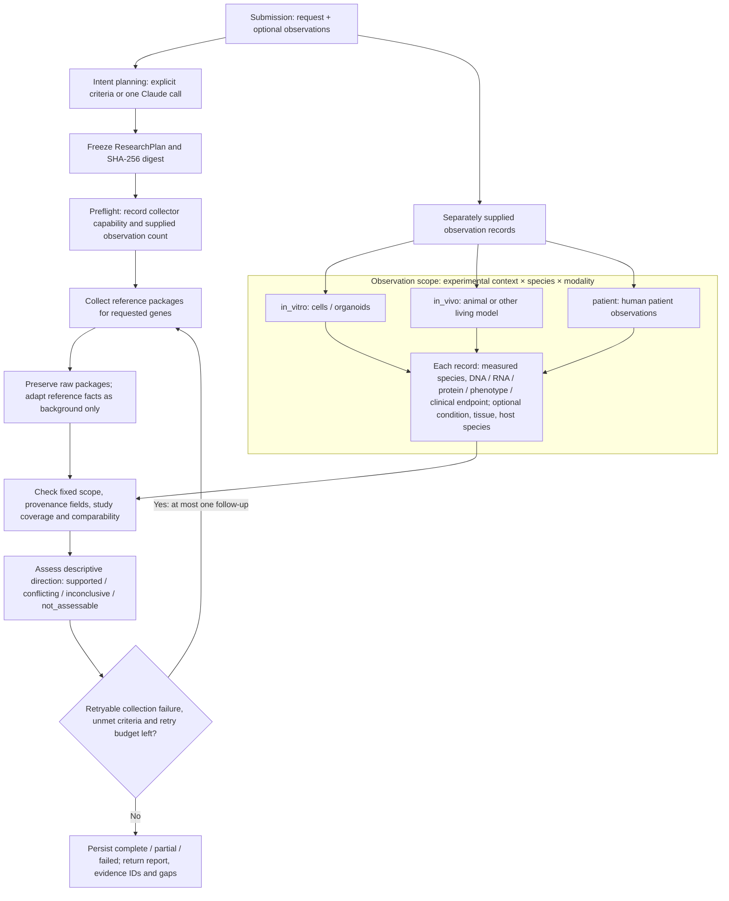

# Cross-context investigation coordinator

This service turns a research request into fixed evidence criteria, collects the current
pipeline's reference packages, checks separately supplied observations, and returns a
traceable report. Its present scientific result is **descriptive comparison of declared
observations**, not a new experimental analysis or independent biological validation.

The frontend can start an investigation and poll its state through HTTP. The CLI and
Modal worker use the same coordinator and contracts.

**Real empirical observations are not connected yet.** The included observations are
explicitly synthetic fixtures. A real dataset/analysis adapter is still needed before
the service can answer a biological question using measured data.

## Execution and scientific meaning



`in_vitro`, `in_vivo`, and `patient` describe **experimental context**. They are not
species or modalities. A human xenograft in a mouse can have
`species="homo_sapiens"`, `context="in_vivo"`, and `host_species="mus_musculus"`.
Requirements can also specify `condition` and `tissue`; generated scope remains an
interpretation requiring review.

The current preflight records known capabilities and the number of supplied
observations. It does not estimate dataset feasibility or execute a scientific feasibility
analysis. The follow-up loop retries technical collection failures for affected genes;
it does not discover missing experiments, revise biological criteria, or rerun a
single-cell analysis. A missing biological observation remains a gap.

| Execution status | Meaning |
| --- | --- |
| `queued` | Accepted and awaiting execution. |
| `running` | Planning, collection, or checking is in progress. |
| `complete` | Mandatory declared evidence checks pass and requested comparisons are assessable. |
| `partial` | Execution finished but some mandatory evidence or comparison prerequisites are missing. |
| `failed` | Planning, scheduling, execution, or a contract check prevented completion. |

`complete`, `partial`, and `failed` are terminal statuses. Scientific meaning is in
`assessment.conclusion`, separately from `status`. An investigation can be **complete
and conflicting**: both contexts have sufficient comparable observations, and their
directions disagree. `criteria_met` is calculated by the checker; it does not mean the
user's biological hypothesis is true. With no comparisons, coverage checks can finish
as complete while the biological conclusion remains `not_assessable`.

## Run locally

Run these commands from the repository root. Runtime package versions are pinned in
[`requirements.txt`](requirements.txt); use an isolated environment.

```bash
python3 -m venv .venv
.venv/bin/python -m pip install -r coordinator/requirements.txt
export XCTX_EVIDENCE_DIR="$PWD/coordinator/examples/packages"
export XCTX_RUN_DIR="/tmp/xctx-investigations"
.venv/bin/python -m uvicorn coordinator.api:create_app --factory --host 127.0.0.1 --port 8000
```

`XCTX_EVIDENCE_DIR` above resolves to an absolute directory of `<gene>.json` packages.
The directory provider replays those files and preserves their original provenance.
Packages must match the requested gene, disease, and collection mode. Run snapshots go
to the external `XCTX_RUN_DIR`, not the repository. If `XCTX_EVIDENCE_DIR` is unset, the
runtime uses the existing Modal evidence collector; there is no silent fixture fallback.

`request.mode` is `explore` by default and can be `eval`; it is passed unchanged to the
collector. It controls source selection only. `eval` does not establish an independent
held-out evaluation or a biomedical gold standard.

Explicit requests with `requirements` and `genes` (or supplied versioned pathway genes)
need no model credentials. Requests without requirements use `ClaudePlanner` and require
both `ANTHROPIC_API_KEY` and `ANTHROPIC_MODEL` in the environment. The model name is never
guessed. Planning makes one forced-schema call, disables SDK retries, and has a 60-second
provider timeout. There is no paid model call in the offline test suite.

Replay the two supplied demonstrations using the same environment variables:

```bash
.venv/bin/python -m coordinator.cli coordinator/examples/missing-evidence.json
.venv/bin/python -m coordinator.cli coordinator/examples/cross-context-conflict.json
```

These are software demonstration fixtures, not biological findings. Local CLI runs were
verified as `partial` / `not_assessable` for the first and `complete` / `conflicting` for
the second. The CLI prints the full `RunState` JSON. Its exit status is nonzero
only for `failed`; callers must inspect the result to distinguish partial evidence from
completed comparison.

## Frontend API contract

Use **`GET /openapi.json`** as the schema source for generated frontend types. The source
of truth is [`models.py`](models.py); do not maintain a separate handwritten request
schema. FastAPI also serves interactive documentation at `/docs`.

| Endpoint | Contract |
| --- | --- |
| `GET /health` | Service health and schema version; not scientific readiness. |
| `POST /investigations` | Accepts a nested `Submission`; returns HTTP 202 with `run_id`, `status`, and `status_url`. |
| `GET /investigations/{run_id}` | Returns the complete `RunState`, including stage, events, frozen plan, evidence, assessment, and error/report when available. |
| `GET /investigations/{run_id}/report` | Returns plain text containing Markdown; returns HTTP 409 before a report is available. |

The POST body has **`request` and `observations` at its top level**. Do not POST the
request fields directly. For example, this explicit request needs no model:

```json
{
  "request": {
    "question": "Is EGFR RNA abundance increased in human lung tumor samples?",
    "genes": ["EGFR"],
    "disease": "lung adenocarcinoma",
    "requirements": [
      {
        "id": "patient-rna",
        "title": "Patient tumor RNA observation",
        "entity": "EGFR",
        "species": "homo_sapiens",
        "context": "patient",
        "modality": "RNA",
        "endpoint": "RNA abundance change versus paired normal",
        "condition": "tumor",
        "tissue": "lung",
        "min_studies": 1,
        "required": true
      }
    ],
    "comparisons": [],
    "max_revisions": 1
  },
  "observations": []
}
```

Empty observations are valid input and will not be replaced with invented findings.
For a complete working fixture request, submit one of the demonstration files:

```bash
curl -X POST http://127.0.0.1:8000/investigations \
  -H 'Content-Type: application/json' \
  --data-binary @coordinator/examples/cross-context-conflict.json
```

When `COORDINATOR_API_TOKEN` is configured, all investigation endpoints require
`Authorization: Bearer <token>`. Local development can omit it; Modal deployment requires
it. `XCTX_ALLOWED_ORIGINS` accepts comma-separated frontend origins and defaults to
`http://localhost:3000,http://127.0.0.1:3000`. Poll until a terminal status and display
the execution status, evidence conclusion, unmatched criteria, and comparison limits
separately. A failed run may have no report; show its `error` and event history.

## Module responsibilities and integration interfaces

| Module / owner | Interface | Boundary |
| --- | --- | --- |
| `models.py` / shared contracts | `Submission`, `InvestigationRequest`, `ResearchPlan`, `EvidenceRecord`, `RunState` | All API and worker schemas; coordinate changes across teams. Extra fields are rejected. |
| `planner.py`, `prompts/intent.md` / intent planning | `Planner.plan(request) -> ResearchPlan`; `ExplicitPlanner`; `ClaudePlanner(model=None, client=None)` | Intent only; no evidence input. Exact structured scope is preserved. |
| `evidence.py` / collection integration | `EvidenceProvider.fetch(symbol, disease, mode, run_id) -> dict`; `adapt_packages(packages) -> EvidenceBundle` | Resolve real packages, preserve raw payload/provenance, retain collection gaps. |
| `checks.py` / declared-evidence checks | `assess(plan, bundle) -> Assessment` | Deterministic scope and comparability checks; never modify criteria or infer missing evidence. |
| `engine.py` / orchestration | `Coordinator.create(submission)`; `execute(run_id, submission)`; `render_report(state)` | Freeze plan, persist events, collect, assess, bounded technical retry, report. |
| `runtime.py` / configuration | `build_coordinator(store=None)`; `AutoPlanner.plan(request)` | Explicit criteria choose the model-free planner; evidence directory selects replay. |
| `store.py` / persistence | `save(state)`, `get(run_id)`; Modal job ID storage | Atomic local JSON snapshots or shared Modal Dict. |
| `api.py` / frontend integration | `create_app(coordinator=None, dispatch=None, api_token=None, refresh=None)` | HTTP submission, polling, reports, authentication, and CORS. |
| `modal_app.py`, `jobs.py` / cloud runtime | `investigate`, `web`, `reconcile_job(state, store)` | Detached cloud execution and worker-result reconciliation during polling. |
| `cli.py` / local demonstrations | `python -m coordinator.cli <submission.json>` | The same engine with a JSON submission file. |

The planner rejects changes to explicit question, genes, disease, requirements,
comparisons, and versioned pathway membership. Natural-language gene extraction only
accepts symbols literally present in the question. Generated criteria are marked as
assumptions; free-text interpretation completeness is not independently verified.
Model-proposed cross-species or context-alignment bases are retained only as unverified
assumptions, with the executable comparison basis left null. Explicit user-supplied
bases are preserved, but their scientific validity is not thereby certified.

The engine permits at most one follow-up because `max_revisions` is limited to 0 or 1.
Its default 240-second budget prevents starting further collections once exhausted;
it is not a hard wall-clock limit for an already running call. The Modal evidence
provider allows 120 seconds for a collector call and attempts cancellation on timeout.
The coordinator Modal worker has a separate 600-second timeout and no automatic retry.

## Modal deployment handoff

The coordinator expects an existing evidence deployment:

- Modal app `xctx-evidence`, function `build_one`.
- Existing volume `xctx-cache` holding `runs/{run_id}/{symbol}.json`.
- A Modal secret named `xctx-coordinator` containing `ANTHROPIC_API_KEY`,
  `ANTHROPIC_MODEL`, and `COORDINATOR_API_TOKEN`; optionally `XCTX_ALLOWED_ORIGINS`.

From the repository root, with Modal authentication already configured:

```bash
.venv/bin/python -m modal deploy -m coordinator.modal_app
```

The app is named `xctx-coordinator`. It uses the pinned runtime requirements, includes
the planner prompt, runs up to four investigation worker containers, and stores state
in the shared `xctx-investigations` Modal Dict. Leave `XCTX_EVIDENCE_DIR` unset for real
collector integration; a local replay path does not automatically exist in the image.

The collector returns a receipt. `ModalEvidenceProvider` validates the exact requested
gene/run path, reads the committed JSON from `xctx-cache`, and validates the package
against the requested gene, disease, mode, and run. A receipt alone is not evidence.

Dispatch saves the detached worker's call ID. Subsequent state/report polls reconcile
that call non-blockingly: pending work stays running, a valid terminal result updates
the snapshot, and a terminated or timed-out worker becomes failed. A temporary failure
to contact Modal does not prove worker failure. Reconciliation occurs during polling
and needs the saved call ID; it is not an independent background monitoring service.

**Live Modal deployment and live model/provider execution have not been verified in
this handoff.** Local fake-provider tests exercise the contracts and failure paths.

## Scientific limits that integrations must retain

Current source packages contain identifier normalization, sequence orthology, GTEx
reference tissue medians, descriptive mouse knockout phenotypes, Open Targets
associations, and PubMed search identifiers/counts. The adapter labels all of these
records `background`, even where a source describes an in-vivo phenotype. They do not
fulfil this coordinator's `observation` requirements. A database miss, omitted row, or
failed request is never interpreted as a biological negative.

Caller-supplied `observations` provide the empirical side of this demonstration.
Qualification requires exact declared entity/species/context/modality/endpoint,
specified condition/tissue/host fields, provenance, source, a study ID, and unique
evidence identity. Comparisons also check endpoint, contrast, comparability key, and
relevant pairing or declared alignment bases. Multiple rows from one study do not
increase the study count; distinct supplied study IDs do not prove cohort independence.

These checks establish **structural consistency of supplied metadata**, not source
truth, valid effect estimation, verified normalization, study quality, or scientifically
valid cross-context alignment. `supported` means descriptive agreement in observed
direction within the eligible subset. It is not significance, causality, clinical
efficacy, or a proof of biological conservation. Supplied versioned pathway membership
defines a gene scope; it does not measure pathway activity. RNA abundance, protein
abundance, and protein activity remain different endpoints.

## Remaining team integration slots

1. **Frontend:** generate types from `/openapi.json`; submit nested `Submission`; show
   events, scope assumptions, criterion evidence IDs, terminal status, conclusion, and
   gaps without equating “complete” with biological support.
2. **Observed-data adapter:** connect one real public dataset or analysis artifact to
   `EvidenceRecord`, with traceable study/assay/contrast/direction and explicit context,
   measured species, tissue, condition, and host where applicable. Do not promote a
   search result or abstract into a measured observation automatically.
3. **Analysis worker:** provide the actual data processing or statistical calculation
   producing those observations. This coordinator currently neither computes a gene
   program nor runs single-cell or bulk differential analysis.
4. **Scientific review:** verify study provenance, independence, comparisons, and
   normalization before treating imported metadata as evidence. Future typed validation
   artifacts can replace the current declared-basis strings through an agreed schema
   change.
5. **Cloud acceptance:** verify the existing collector/volume, configured secret,
   authenticated API, detached execution, and terminal-state polling with a real run.

Install the development requirements and run offline checks:

```bash
.venv/bin/python -m pip install -r coordinator/requirements-dev.txt
.venv/bin/python -m pytest coordinator/tests -q
```

The intent-first criteria and separate verification procedure are informed by
[AutoSciRub at commit 333a9e5](https://github.com/zjunlp/AutoSciRub/tree/333a9e5b7e405f54aca2e74d9c4f58aeece96332).
This is an adaptation of procedures using an original prompt and application code;
no AutoSciRub code or skill text is vendored. It does not implement the complete
AutoSciRub system or inherit any reported scientific accuracy or benchmark performance.
