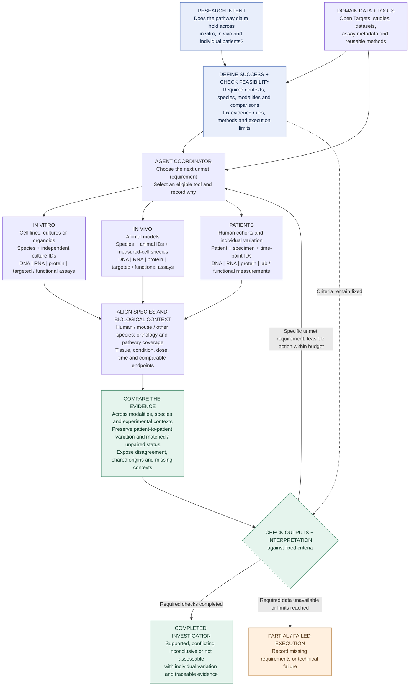

# Multimodal, multispecies biological validation agent

Shared design and reusable-component review · Version 3 · 22 September 2026

**Audience:** project teammates and the agents assisting them.  
**Status:** one architecture retains in-vitro, in-vivo and patient contexts, with multiple species and measurement types inside that comparison. Patient-to-patient variation remains explicit. Section 7 specifies a 10–20 minute evaluation within the four-hour build. This is a design document: the architecture, integrations and numerical validators have not been implemented or benchmarked. Model/provider selection and Modal engineering remain deferred.

## 1. Intent and scope

Help a computational biology researcher assess a specific pathway, cell state or biological claim across **in vitro → in vivo → patients**, using **multiple measurement types and multiple species**, while preserving differences between individual patients. Determine which evidence supports the claim, which challenges it, which is only background, and where a valid comparison is unavailable.

The purpose is to help researchers decide which findings deserve follow-up, which experimental models address their question, and whether a cohort-level finding conceals patient differences. More retrieved records or more agreeing modalities do not by themselves make a conclusion stronger. The system must inspect what was measured and whether the evidence tests the same claim.

### Evidence dimensions

| Dimension | What the workflow must preserve |
|---|---|
| Measurement | DNA variants/genetic associations or copy number; single-cell/bulk RNA; protein abundance/proteomics; phosphorylation/post-translational modifications; direct activity assays or explicitly labeled activity inference; RT-qPCR expression; relevant functional assays and laboratory measurements. |
| Species | Organism, genome/reference version, gene/protein identifiers and orthology. Record the species of measured cells separately from the host animal in xenografts. |
| Experimental context | In vitro, in vivo and human patient/reference samples, with tissue/cell type, condition, intervention, dose and time when relevant. Species and context are separate axes. |
| Individuals | Patient/donor/animal/culture replicate IDs, specimen and time point; patient-to-patient variation and repeated measurements. |
| Provenance and independence | Original study, cohort, assay and underlying samples. Two portals citing the same experiment do not provide two independent replications. |

“Multimodal” here means multiple biological measurement types. RT-qPCR can corroborate an RNA measurement; it is not automatically a separate biological layer or proof of protein activity. A DNA association, an RNA change and a protein activity assay address different parts of a claim. Their expected relationships must be specified rather than assumed.

For patient-level comparisons, distinguish **matched measurements from the same person/specimen/time point** from measurements in unrelated cohorts. Unpaired data can contribute cohort-level evidence; it cannot establish within-patient agreement. Report individual variation with uncertainty, without presenting a two-person comparison as population-level validation.

The intended result is a claim-linked evidence table across these dimensions, with supporting calculations where data are available and clearly labeled published results otherwise. “Validation” means assessing specified evidence requirements; it does not imply causal proof, clinical validation or a treatment recommendation.

**Proposed first demonstration:** one narrow pathway claim, two relevant measurement types, human and one additional species, and a small evidence package spanning cultured cells, an animal model and individual patients. The architecture keeps all three contexts. An unavailable context remains a visible gap with the corresponding requirement unmet; it is not silently removed. Use processed data or transparently labeled test fixtures to fit the time limit. This bounded demonstration does not establish coverage of every possible assay. Disease, accessions and numerical scientific thresholds remain to be selected from feasible data.

## 2. Architecture



This is the single canonical architecture. Its three branches are experimental contexts, not three mandatory conversational agents. **Every branch can contain multiple modalities and species.** In vitro/in vivo describe the experimental setting; human/mouse/other organisms identify species. Human cells in a mouse host require both identities. RT-qPCR and other targeted assays remain part of the measurement inventory in section 1.

Track evidence as **context × species × modality × individual/specimen**. Keep required but missing entries visible. Analyze each dataset appropriately, then align identifiers and compare eligible findings; do not merge raw assay units into a universal score. The comparison does not establish a causal chain or guarantee transfer to patients.

### Where the architecture comes from

This design adapts existing patterns; it does not claim to invent iterative agents or to have implemented these references already.

| Reference | What informs this design |
|---|---|
| User-supplied hackathon photos, especially slides 1 and 3 | Define success; use held-out tests; compare fairly; inspect evidence; connect domain data and tools to workflow logic and checks. The photos motivate the design but are not a published method or performance result. |
| [AutoSciRub, preprint submitted 31 August 2026](https://arxiv.org/abs/2608.31076) | Define task-specific evidence requirements before execution; inspect unmet criteria and use targeted revision. We adapt this to biological comparability and sample-level evidence. |
| [Anthropic: Building effective agents, 19 December 2024](https://www.anthropic.com/engineering/building-effective-agents) | Tool use with feedback, routing and evaluator–optimizer patterns. This is an architectural reference, not a claim about the newest implementation stack. |
| [Anthropic: Demystifying evals for AI agents, 9 January 2026](https://www.anthropic.com/engineering/demystifying-evals-for-ai-agents) | Evaluate actual outcomes and execution traces with appropriate checks; keep system evaluation distinct from an agent's own assertion of success. |

### Intended distinction from existing systems

| System | Existing overlap | Proposed additional behavior to demonstrate |
|---|---|---|
| [Open Targets MCP](https://github.com/opentargets/platform-mcp#strategy) | Existing biological evidence, identifiers and a schema-to-query workflow. | Execute and verify the specific multimodal, multispecies comparison, retaining patient variation and assay meaning. See section 9. |
| [Biomni](https://github.com/snap-stanford/Biomni/blob/main/biomni/agent/a1.py) and general tool-using agents | Iterative execution and observation; Biomni also provides optional self-critique and custom tools. | A reusable task-specific protocol that catches invalid comparisons, selects an appropriate follow-up and stops honestly. Biomni could also host this protocol. |
| [AutoSciRub](https://github.com/zjunlp/AutoSciRub) | Criteria generation, verification guidance and bounded revision. | Biological measurement contracts, species/sample mappings and independently checked numerical outputs for this particular task. |

The differentiation is a hypothesis about useful behavior, not a proven superiority claim: can this package complete valid investigations with fewer unsupported conclusions and less researcher intervention? A loop or an additional modality by itself does not establish that advantage.

## 3. What counts as success?

### A. Completing a research task

Before execution, record the question, comparison groups, biological replicate unit, allowed analyses, evidence requirements, decision rules and budget. The agent may propose these; the researcher confirms the scientific choices.

| Requirement | Evidence and completion check |
|---|---|
| Suitable data | Accessions, versions, files, assay/modality, measured quantity, units, species, tissue/cell context, condition and independent sample IDs are recorded. Missing metadata is explicit. |
| Valid comparisons | Each comparison has a documented rationale. Record measured-cell species separately from animal host for xenografts; record ortholog mapping where needed. |
| Executed analysis | Required numerical outputs and execution records exist and pass their checks. Relevant parameters, input versions and software versions are preserved. |
| Supported interpretation | Every substantive conclusion links to an output and its uncertainty. Interpretive ambiguity is flagged for scientific review. |
| Bounded execution | Retries, time and cost obey the predeclared limits. Technical failure cannot be reported as a biological negative result. |
| Independent corroboration | Shared cohorts, specimens, publications and computational derivations are identified. Repeated access to one study is not counted as replication. |
| Patient-level claims | Matched/unpaired status and repeated samples are explicit. Within-patient conclusions require linked patient/specimen metadata. |

**Complete** means all required analyses and operational checks were finished. An inconclusive scientific answer can still be complete. A required calculation that cannot run because its data are missing produces a partial result; unrecovered technical errors produce a failed result. An optional evidence search may complete with “not found.” Keep the mandatory/optional distinction fixed after feasibility review; do not remove a requirement just to declare completion.

### B. Answering the scientific question

Report a separate finding for each comparison: **supported**, **conflicting**, **inconclusive**, or **not assessable**. A non-significant result alone does not establish absence or contradiction. Matching program scores alone does not establish a shared causal mechanism.

Choose effect-size, uncertainty and replication rules for the specific question before full analysis. Use patients, animals or independent culture experiments as the biological replicate units. Avoid treating individual cells as independent patients. Compare predefined within-dataset contrasts; do not assume absolute scores from different datasets are directly comparable.

Specify the expected biological relationship between measurements. Increased RNA and unchanged protein may be informative rather than contradictory; protein abundance alone is not an activity assay. Phosphorylation does not automatically establish activation: retain the measured site, assay and expected functional relationship. Genetic association can support relevance without proving the direction of a molecular effect. A claim about pathway activity requires suitable activity evidence or an explicitly labeled inference with its assumptions.

Cross-species comparisons must retain one-to-many and missing orthologs, pathway mapping coverage, species-specific biology and experimental differences. Patient-to-patient analysis must preserve heterogeneity rather than replace all individuals with one cohort average. Any subgroup explanation generated after seeing results is exploratory until tested independently.

Numerical and structural checks should inspect saved outputs with explicit rules. LLM review can assist interpretation but does not replace those checks. The agent may repair execution problems; changing the scientific question, thresholds or selected population creates a new versioned analysis.

### C. Demonstrating that the agent adds value

Use held-out cases with researcher-reviewed reference analyses, including supported findings, disagreement and insufficient evidence. Keep reference answers inaccessible to the running agent. Compare against a general agent given the same tools, data and budget. Measure valid task completion, unsupported claims, appropriate abstention, human corrections, time and cost. No superiority claim has been established yet.

This is how we validate the validation system. During development, use small reference calculations and deliberately mismatched evidence to check the validators. For final evaluation, freeze the workflow and use unseen cases; the agent may inspect task inputs but not hidden reference answers. Keep related samples/studies and duplicated evidence together when separating development and held-out cases. Final test feedback must not become another optimization loop on the same test cases. Section 7 gives the minimal plan.

## 4. Reusable candidates

The inventory below is a capability library. The agent can select an appropriate available tool using its skill instructions and the task's requirements. There is no requirement to compare every candidate against every alternative. Some entries are substitutes; many serve different purposes and can be combined. Availability means source/documentation inspected, not successful integration. License labels describe the identified code or skill; external datasets and services can have separate terms. Pin the chosen revision during engineering.

### 4.1 Agent tools and procedural skills

| Candidate | What can be reused | Fit and unresolved work |
|---|---|---|
| **[Biomni](https://github.com/snap-stanford/Biomni)** — Apache-2.0 core | Biomedical Python tools, tool descriptions, agent execution, custom-tool/MCP interfaces and Know-How documents. | Reuse suitable tools or the existing agent as a backend. Check only the dependencies and behavior needed for the selected task. The hosted Biomni Lab product is distinct from this public code. |
| **[ToolUniverse](https://github.com/mims-harvard/ToolUniverse)** — current [LICENSE](https://github.com/mims-harvard/ToolUniverse/blob/main/LICENSE): Apache-2.0 | Scientific tool discovery/execution through Python or MCP, plus a [dataset-discovery skill](https://github.com/mims-harvard/ToolUniverse/blob/main/skills/tooluniverse-dataset-discovery/SKILL.md). | Candidate for finding datasets and accessing APIs. A search result or successful API response does not prove that usable measurements or the needed metadata are available. |
| **[K-Dense Scientific Agent Skills](https://github.com/K-Dense-AI/scientific-agent-skills)** — repository MIT; individual licenses vary | Existing [Scanpy instructions/scripts](https://github.com/K-Dense-AI/scientific-agent-skills/blob/main/skills/scanpy/SKILL.md) and [Census access guidance](https://github.com/K-Dense-AI/scientific-agent-skills/blob/main/skills/cellxgene-census/SKILL.md). | Candidate for agent-facing procedures. Inspect only relevant skills. The inspected Scanpy skill declares BSD-3-Clause; skill instructions are separate from scientific validation. |
| **[Anthropic bio-research](https://github.com/anthropics/knowledge-work-plugins/tree/main/bio-research)** — skills Apache-2.0 | [Single-cell RNA QC](https://github.com/anthropics/knowledge-work-plugins/blob/main/bio-research/skills/single-cell-rna-qc/SKILL.md), associated QC scripts and other biological workflow guidance. | Candidate for input/QC procedures. Adapt QC to the dataset; passing QC does not establish comparability across contexts. External MCP services have separate requirements. |
| **[Open Targets Platform MCP](https://github.com/opentargets/platform-mcp)** — code Apache-2.0; Platform data CC0 | Entity resolution, GraphQL schema discovery and evidence queries against the integrated Open Targets Platform. | Reuse for existing biological evidence and reference context. It does not execute our expression-matrix analyses. See the source audit in section 9. |

### 4.2 Data access and numerical analysis

| Candidate | Role and code license | Fit and unresolved work |
|---|---|---|
| **[AnnData](https://github.com/scverse/anndata) + [Scanpy](https://github.com/scverse/scanpy)** | Annotated expression data, preprocessing and analysis; BSD-3-Clause. | Common data representation and baseline analysis. [Gene scoring](https://scanpy.readthedocs.io/en/stable/generated/scanpy.tl.score_genes.html) is available; metadata adapters and sample-level comparisons still need definition. |
| **[CELLxGENE Census](https://github.com/chanzuckerberg/cellxgene-census)** | Query metadata and actual expression slices; code MIT, Census data described as CC-BY. | Strong candidate for public reference data. Pin the release, avoid duplicate cells and verify dataset coverage and required conditions. See the [query guide](https://chanzuckerberg.github.io/cellxgene-census/cellxgene_census_docsite_quick_start.html). |
| **[GEOparse](https://github.com/guma44/GEOparse)** | Retrieve/parse accession metadata and deposited supplementary files; [BSD-3-Clause](https://github.com/guma44/GEOparse/blob/master/LICENSE). | Complementary route for cell-line, animal and patient experiments. A GEO record does not guarantee a ready-to-analyze count matrix; inspect each deposited file. |
| **[gget](https://github.com/scverse/gget)** | Gene lookup and modular access to several biological services; [BSD-2-Clause](https://github.com/scverse/gget/blob/main/LICENSE). | Useful for ID checks and selected queries. Its Census interface is an alternative access path, not an independent biological cohort. |
| **[decoupler](https://github.com/scverse/decoupler)** | Program/enrichment methods and [sample-level pseudobulk aggregation](https://decoupler.readthedocs.io/en/latest/api/generated/decoupler.pp.pseudobulk.html); [BSD-3-Clause](https://github.com/scverse/decoupler/blob/main/LICENSE). | Select a method, such as [ULM](https://decoupler.readthedocs.io/en/latest/api/generated/decoupler.mt.ulm.html), when its inputs and assumptions fit the question. External prior networks have [separate licenses](https://decoupler.readthedocs.io/en/latest/notebooks/omnipath/licenses.html). |
| **[pyUCell](https://github.com/carmonalab/pyucell)** | Rank-based signature scoring for AnnData; [MIT](https://github.com/carmonalab/pyucell/blob/master/LICENSE). | Alternative to Scanpy scoring. Fix gene universe, rank parameters and missing-gene treatment. The Python package is distinct from the GPL-licensed R UCell implementation. See [parameters](https://pyucell.readthedocs.io/en/latest/notebooks/parameters.html). |

Scanpy scoring, pyUCell and decoupler methods estimate different quantities. Judge suitability against the scientific question and expected behavior, rather than requiring their raw scores to agree. Pseudobulk aggregation can complement a chosen scoring method.

### 4.3 Evaluation, packaging and execution control

| Candidate | What can be reused | Fit and unresolved work |
|---|---|---|
| **[AutoSciRub](https://github.com/zjunlp/AutoSciRub)** — MIT; [August 2026 paper](https://arxiv.org/abs/2608.31076) | Skills and supporting scripts for turning a research request into explicit criteria, then guiding evidence checks and bounded revision. | Architectural reference and potential reusable procedures. The host agent performs the research; biological criteria and numerical validators still need review and implementation. See the explanation below. |
| **[SkillFoundry](https://github.com/ma-compbio-lab/SkillFoundry)** — [Apache-2.0](https://github.com/ma-compbio-lab/SkillFoundry/blob/main/LICENSE); [April 2026 paper](https://arxiv.org/abs/2604.03964) | Framework and skill library for converting scientific resources into packages with scope, inputs/outputs, dependencies, provenance and tests. | Strong packaging candidate. First inspect existing relevant skills and a single bounded conversion. Operating its entire self-expanding library is unnecessary for the initial demo. |
| **[Google DeepMind Science Skills](https://github.com/google-deepmind/science-skills)** — software Apache-2.0; other materials CC-BY-4.0 | Scientific instructions/helpers and a [workflow-skill creator](https://github.com/google-deepmind/science-skills/blob/main/skills/workflow_skill_creator/SKILL.md). | Candidate for packaging a workflow after it has run successfully. The creator explicitly targets completed workflows. Source-specific terms are listed in [SKILL_LICENSES.md](https://github.com/google-deepmind/science-skills/blob/main/SKILL_LICENSES.md). |
| **[LangGraph](https://github.com/langchain-ai/langgraph) / [DeepAgents](https://github.com/langchain-ai/deepagents)** — MIT OSS | State, conditional execution and checkpoints; DeepAgents adds higher-level agent facilities and skill loading. | Engineering options for the coordinator. Choose the simplest suitable runner and add persistent recovery when required; a framework comparison is not a prerequisite. |

**What AutoSciRub actually does:** its controller skill guides the host agent through goal extraction, literature grounding, data inspection, criterion creation, research execution, verification and limited revision. A criterion specifies what must be done, which result should demonstrate it, and what condition counts as satisfied. Unmet criteria guide follow-up work. The skill does not independently guarantee scientific correctness. [Controller skill](https://github.com/zjunlp/AutoSciRub/blob/main/plugins/autoscirub/skills/autoscirub/SKILL.md)

Its command-line helpers prepare configuration, inspect setup and retrieve references; their successful execution is not validation of a biological conclusion. [CLI source](https://github.com/zjunlp/AutoSciRub/blob/main/scripts/autoscirub.py)

**Our proposed adaptation:** for a claim about protein activity in patients, require a suitable measured endpoint or explicitly labeled inference, linked patient/specimen metadata, an appropriate comparison and saved results. A literature citation or RNA score cannot silently satisfy that requirement. Our validators would check the concrete outputs; scientific judgments that cannot be automated remain explicit review items. This adaptation has not yet been implemented.

Evaluation, packaging and execution control are different jobs. AutoSciRub supplies criteria-oriented procedures; SkillFoundry and the DeepMind creator help package reusable procedures; an agent runner controls execution and state. They need not compete for one slot.

### 4.4 Additional sources for multimodal and multispecies work

These are API/data candidates, not newly installed skills. Use them when the chosen question needs their capability; do not connect every source by default. Their access terms and exact files must be checked when selecting a study.

| Source | Capability and appropriate use | Boundary to preserve |
|---|---|---|
| [Ensembl Compara / REST](https://rest.ensembl.org/documentation/info/homology_species_gene_id) | Retrieve species-specific orthology for molecular identifier mapping. | Preserve [one-to-one, one-to-many and many-to-many relationships](https://mart.ensembl.org/info/genome/compara/homology_types.html). Homology is not an observed cross-species replication. |
| [Reactome Content Service](https://reactome.org/dev/content-service) | Retrieve pathway participants, reactions and supporting records for a versioned pathway definition. | [Computationally inferred events in other species](https://reactome.org/documentation/inferred-events) must be labeled; they are not independent experiments. |
| [PRIDE Archive API](https://www.ebi.ac.uk/pride/ws/archive/v2/docs/api-guide.html) | Find proteomics projects, files and experimental metadata. | Confirm quantitative tables, processing state and sample links; discovering a project does not yield a universally standardized protein matrix. |
| [NCI GDC API](https://docs.gdc.cancer.gov/API/Users_Guide/Search_and_Retrieval/) | Find human cancer molecular data with case and biospecimen metadata, when relevant to the selected disease. | Verify case–sample–aliquot relationships and modality coverage. [Access varies between open and controlled data](https://gdc.cancer.gov/access-data/data-access-processes-and-tools); public access does not imply every file or matched assay is available. |
| Published supplementary tables and researcher-provided assay files | Capture RT-qPCR, targeted protein measurements, laboratory tests and functional endpoints with source references. | Define an assay-specific parser and measurement contract. Preserve controls, units, normalization and biological versus technical replicates; mark figure-only or reported-only evidence. No universal assay connector is assumed. |

### 4.5 How the agent chooses tools

Each available capability should have a short skill/tool description: purpose; eligible inputs and context; prerequisites; output meaning and units; limitations; failure behavior; source/version; and the checks that apply to its output. A library name alone is insufficient guidance.

The agent selects an eligible tool for the current unmet requirement, records its rationale and runs it. A checker validates the output before it becomes evidence for a claim. If the tool is unavailable or the inputs do not fit, select an eligible alternative or record the gap. Selecting another method after observing an unfavorable scientific result is not an automatic repair; it must follow the predeclared analysis plan or become a separate exploratory analysis.

Listing multiple tools in skills is compatible with this design. Section 7 tests the resulting choices and outcomes; it does not require a universal ranking of the tools.

## 5. Reusable Biomni components

Treat Biomni's executable tools, tool-description schemas and Know-How documents as distinct reuse surfaces. Do not assume that everything described as a platform “skill” is an exportable SKILL.md package.

Start with the following source-level candidates:

| Surface | Candidate use | Acceptance question |
|---|---|---|
| `query_geo` in [database.py](https://github.com/snap-stanford/Biomni/blob/main/biomni/tool/database.py) | Retrieve GEO search results for a structured query. It does not itself download the expression matrix. | Does it return the correct accessions and enough evidence to inspect file availability and sample metadata? |
| Synapse query/download helpers in [database.py](https://github.com/snap-stanford/Biomni/blob/main/biomni/tool/database.py) and [support_tools.py](https://github.com/snap-stanford/Biomni/blob/main/biomni/tool/support_tools.py) | Retrieve relevant deposited data if the selected study uses Synapse. | Are access requirements, download behavior and dependencies compatible with the demo? |
| `gene_set_enrichment_analysis` in [genomics.py](https://github.com/snap-stanford/Biomni/blob/main/biomni/tool/genomics.py) | Candidate enrichment helper. | This wraps unranked Enrichr-style enrichment; is that the intended analysis? It cannot stand in for a signed or cell-level program comparison. |
| `interspecies_gene_conversion` in [genomics.py](https://github.com/snap-stanford/Biomni/blob/main/biomni/tool/genomics.py) | Candidate BioMart-based gene mapping helper. | The inspected implementation does not explicitly filter one-to-one orthologs despite its description. Preserve orthology type, one-to-many mappings and unmapped genes in a reviewed adapter. |
| `A1.add_tool`, `A1.add_mcp`, `A1.create_mcp_server` in [a1.py](https://github.com/snap-stanford/Biomni/blob/main/biomni/agent/a1.py), with [MCP documentation](https://github.com/snap-stanford/Biomni/blob/main/docs/mcp_integration.md) | Register our adapters and checks around selected tools. | Can every invocation return explicit input references, output references and failure status? Review generated tool schemas before adopting them. |

Prefer importing or wrapping a small verified component when practical. If modifying copied code, preserve its upstream source, revision, license and attribution. The full Biomni agent remains an execution-backend option; using it does not require benchmarking every other framework first.

## 6. Packaging for shared use

Use one shared design, portable skill instructions and explicit tool contracts. The following is a **proposed package layout**, not an implemented package:

```text
project/
  DESIGN.md                 # This shared document and decisions
  skills/
    cross-context-analysis/
      SKILL.md              # When to run; steps; stop and review rules
      references/           # Methods, upstream sources and examples
  tools/                    # Selected data/analysis/checking adapters
  schemas/                  # Dataset, criterion, evidence and run records
  evals/                    # Development fixtures and separate held-out cases
  runs/<run-id>/             # Versioned inputs, outputs, checks and report
```

| Shared record | Required information |
|---|---|
| Dataset manifest | Accession/release, source URL, actual file, processing state, species/host, assay/modality, measured quantity/units, context, subject/specimen/time-point IDs, pairing status, metadata gaps and reuse terms. |
| Criterion record | Goal, required comparison, method/metric, fixed decision rule, expected evidence, checker and verification status. |
| Run manifest | Input references, tool/package versions, parameters, dependencies, budget, execution status and output locations. |
| Evidence record | Claim, evidence role, species/context, modality/assay, subject/specimen IDs, measured versus inferred result, uncertainty, criterion ID, source-study dependencies and supporting output paths. Distinguish results computed here from published results. |
| Verification report | Passed, failed and unresolved checks; reasons; remaining work; final execution status. |
| Tool selection record | Unmet requirement, selected tool/version, input compatibility, selection reason, executed parameters, output checks and any fallback. |

Keep large expression matrices in data files; pass references and summaries to the agent. A completed step can be reused only when its inputs, parameters and relevant tool versions match. If a dataset changes, invalidate that branch and dependent comparisons. Preserve previous runs.

A skill explains **how to perform a task**; a tool performs a specific operation; a coordinator controls ordering and retries; an evaluator checks the evidence. An instruction that says “check your work” is not itself an implemented validator.

## 7. A 10–20 minute evaluation for the four-hour build

**Time constraint:** four hours covers the whole build. Prepare tiny test inputs alongside development; reserve only 10–20 minutes for the final comparison and scoring. Do not install several competing frameworks or build a large benchmark.

### A. How other agent projects establish improvement

They distinguish an agent checking its own work from an external evaluation of the finished result. A task has fixed inputs and requirements; the agent executes; a separate grader checks outputs and the action log against reference facts. Numerical checks, human judgment and sometimes calibrated LLM grading serve different roles. [Anthropic evaluation guide](https://www.anthropic.com/engineering/demystifying-evals-for-ai-agents)

[AutoSciRub](https://arxiv.org/html/2608.31076v1) compares a base agent with the same setup plus criteria-oriented guidance, using external benchmark grading and component ablations. Its experiments do not fully equalize the additional model-call cost. Its runtime self-verification is therefore not the evidence of improvement by itself. It supplies useful procedures, not a ready-made gold-standard test set for our multimodal, multispecies question.

[Biomni's paper](https://cs.stanford.edu/people/jure/pubs/biomni-biorxiv25.pdf) uses held-out benchmark questions, baseline agents and repeated runs; for one LAB-Bench evaluation it separates 45 development questions from 315 test questions and averages three runs. We borrow the separation of development, final scoring and baselines, not its benchmark scale.

### B. One fair comparison

| Configuration | Behavior |
|---|---|
| **A — ordinary tool-using agent** | A competent prompt, with planning, tool selection, checking and retries allowed. |
| **B — our workflow** | The same base agent plus explicit criterion tracking, enforced output checks and follow-up selected from unmet requirements. |

Give both the **same model, user prompt, scientific rules, input files, tools and per-run limits**. Expose the same numerical/checking tools to both; our workflow requires their appropriate use, while the baseline may choose to use them. Do not make A a single-shot chatbot or hide useful tools from it. Both can select tools freely within the task's eligibility rules.

Use the current working agent as A. If the actual Biomni agent is already running, it can be A; otherwise call it an ordinary-agent baseline and make no claim of outperforming Biomni. This comparison tests the workflow package, not the isolated contribution of every component.

### C. Three small cases, six runs total

Use a single narrow pathway claim and small processed RNA/protein tables spanning **cultured cells, an animal model and human patients**, with human/mouse mappings and individual sample metadata. Prepare one separate development example for debugging. A teammate should prepare or review the three final cases before the workflow is frozen, and keep their reference answers outside the agent's accessible files. Do not tune on final cases and later call them held out.

| Case | Input situation | Independently specified expected behavior |
|---|---|---|
| **1. Valid corroboration** | Compatible measurements, reviewed species mappings and linked patient samples satisfy the predefined abundance claim. | Report support at the stated scope, with correct calculations, source links and individual variation. Do not upgrade abundance evidence into activity or clinical efficacy. |
| **2. Invalid patient pairing** | RNA and protein come from different patients, although cohort summaries look similar. | Mark within-patient corroboration as not assessable; report any legitimate cohort-level evidence separately. Do not invent patient matches. |
| **3. Recoverable missing evidence** | A required sample map is absent from the initial input but available through a documented tool/file link accessible to both systems. After recovery, the measurements disagree under the predeclared rule. | Retrieve the map, complete the valid calculation and report the disagreement. Do not stop early or keep changing methods until they agree. |

Case labels above are for the evaluation team. Give the running agents neutral case IDs and the actual task; do not reveal the expected result. A required follow-up should be a real tool/file operation in the trace, not a sentence promising future work. Do not require a particular tool sequence if another valid route achieves the same result.

Use cached public extracts if already available. Otherwise use explicitly labeled synthetic fixtures for these logic checks. Do not alter public measurements and present the altered values as real findings. Shared source data or constructed variants make this a small stress test, not three independent biological replications. A live data-search demonstration can be shown separately; it is not part of this timed comparison.

**Shared prompt template for both configurations:**

> Assess the predeclared pathway claim across in-vitro, in-vivo and patient evidence using the supplied scientific rules and available tools. Determine what is supported across species and measurement types and what can be concluded about individual patients. Retrieve any available missing metadata, run the required calculations, and preserve disagreement or uncertainty. Return the status of each required comparison, numerical evidence, source/sample IDs, limitations and execution status. Keep missing required contexts visible. Follow the supplied time and tool limits.

The case manifest must provide the specific pathway, comparisons, required evidence and decision rules before execution. Model/provider choice remains an engineering decision; hold that choice fixed across A and B.

### D. A fixed scorecard, graded outside the agent

Each case passes only if all three checks pass:

1. **Conclusion:** the comparison statuses match the independently reviewed evidence, including justified support, disagreement or inability to assess.
2. **Evidence:** required calculations and IDs match the reference within declared tolerance; no invented pairing, unsupported activity claim or duplicate replication count.
3. **Completion:** required feasible work was actually performed; missing evidence, timeout or failure receives the correct status.

Use direct table/ID/numerical checks plus a brief reviewer check of interpretation. Blind the reviewer to A/B where practical. An LLM may assist but must not be the sole judge of its own conclusions. Do not score prose polish or agreement with the researcher's hoped-for result.

| Case | A: conclusion / evidence / completion | B: conclusion / evidence / completion | Time and substantive error |
|---|---|---|---|
| 1 | Not run | Not run | Not measured |
| 2 | Not run | Not run | Not measured |
| 3 | Not run | Not run | Not measured |

Report **cases passed out of 3**, false support claims, elapsed time and tool calls for both. Count unplanned human corrections; do not silently repair scored runs. Keep all six outputs and action logs, including failures. Additional tokens and compute count toward B's budget too.

### E. Run it in 10–20 minutes

| Time | Action |
|---|---|
| 0–2 minutes | Freeze the two configurations, case files and scorecard; start clean sessions with no shared memory between runs. |
| 2–11 minutes | Run all six attempts with a 90-second limit each. Run A/B pairs concurrently if convenient; cap each at 10 tool calls and an identical total token ceiling supported by the runner. |
| 11–16 minutes | Check numerical outputs and IDs, then review the three conclusion/completion judgments for each system. |
| 16–20 minutes | Fill the table and show one complete action trace alongside all six outcomes. |

Choose the token ceiling once using the development example, before final evaluation. Timeouts remain recorded outcomes. If extra time is available, repeat the whole set for both systems; do not selectively retry failures or show only the best attempt. Freeze inputs and source responses so network variation does not masquerade as a workflow benefit.

**Allowed conclusion:** report the observed A/B results on these three specified cases and the actual time/cost tradeoff. If B passes more cases without more false support, that is preliminary evidence of value on this task. If they tie, report the tie; traceability or usability can be demonstrated separately, but an accuracy advantage has not been shown. If B is worse, report the failures. This small pilot cannot establish statistical or general superiority over research agents.

## 8. Decisions before engineering

1. Choose one biological claim and inspect feasibility across modalities, species, experimental contexts and individuals. Mark mandatory versus optional evidence after this inspection.
2. Fix the pathway/program definition, expected relationships between assays, eligible comparisons, replicate units and scientific decision rules.
3. Reuse Open Targets for suitable existing evidence and register only the capabilities needed for the first complete investigation; let the agent select eligible tools within that scope.
4. Prepare the small reference cases in section 7 to test the data adapters, numerical checks and evidence judgments used by that investigation.
5. Implement one complete path through analysis, evidence checking and explicit termination; then package the working path for reuse and conduct the held-out comparison.

This revision incorporates the requested scope and architectural direction. No specific disease, dataset bundle, agent backend or numerical method is selected by this document. Model/provider and Modal deployment choices remain deferred as requested.

## 9. Open Targets reuse audit

Reviewed 22 September 2026. This is a repository/documentation audit: no MCP server was deployed, live queries executed or complete cohort downloaded. Field-level availability must be checked against the chosen release.

**Decision:** use Open Targets as a source of existing evidence. A product that only retrieves and summarizes target–disease evidence substantially overlaps with Claude plus this MCP. Our proposed additional function is to execute a specified cross-context comparison on suitable experimental data and verify the resulting claims. Its value remains to be demonstrated.

### What the repository provides

This is an official **Open Targets** project; Claude is a supported client. Its five read-only tools cover schema discovery, type dependencies, entity search, individual GraphQL queries and batch queries. The upstream is the Open Targets Platform API, not a separate direct connection to every original data provider. No registered tool executes our single-cell processing or program comparison. [Repository](https://github.com/opentargets/platform-mcp) · [Tool registration](https://github.com/opentargets/platform-mcp/blob/main/src/open_targets_platform_mcp/create_server.py)

| Reusable component | Concrete use |
|---|---|
| [Entity search](https://github.com/opentargets/platform-mcp/blob/main/src/open_targets_platform_mcp/tools/search_entities/search_entities.py) | Resolve names to candidate Platform identifiers; check ambiguous matches. |
| [Schema discovery](https://github.com/opentargets/platform-mcp/blob/main/src/open_targets_platform_mcp/tools/schema/schema.py) and [GraphQL client](https://github.com/opentargets/platform-mcp/blob/main/src/open_targets_platform_mcp/client/graphql.py) | Retrieve the fields actually available for the selected entities and retain underlying evidence identifiers. |
| [Batch query tool](https://github.com/opentargets/platform-mcp/blob/main/src/open_targets_platform_mcp/tools/batch_query/batch_query.py) | Repeat a query with different variables. This implementation serializes upstream requests; it is not an analysis-compute engine. |
| [Release datasets](https://platform-docs.opentargets.org/data-access/datasets) | Use versioned Parquet files for systematic analysis. Open Targets also provides [BigQuery access](https://platform-docs.opentargets.org/data-access/google-bigquery). |

Prefer connecting to the existing service or importing a bounded component over forking the entire platform. The source files above are executable tools, not a collection of portable biological SKILL.md procedures.

### Evidence coverage and interpretation

| Existing coverage | What it can contribute; remaining distinction |
|---|---|
| Project Score and CRISPRbrain | In-vitro perturbation evidence already exists. It is not automatically a measurement of the specified expression program. [Evidence documentation](https://platform-docs.opentargets.org/evidence) |
| DepMap | Cell-line dependency measurements are available; fitness and cell-state expression are different endpoints. [Gene essentiality](https://platform-docs.opentargets.org/target/core-gene-essentiality) |
| IMPC, human genetics and Expression Atlas | Mouse phenotype, genetic and differential-expression evidence provide context. These do not establish that our exact experimental contrast reproduces across all three settings. [Evidence documentation](https://platform-docs.opentargets.org/evidence) |
| Clinical reports | Trials, development stages and regulatory records provide clinical context. A trial record or phase does not establish efficacy. [Clinical reports](https://platform-docs.opentargets.org/drug/clinical-report) |
| Baseline expression | June 2026 documentation includes Tabula Sapiens single-cell-derived profiles, GTEx/DICE bulk RNA and PRIDE proteomics. It describes donor-level processing and aggregated outputs. This is healthy/unstimulated reference expression; which donor-level fields are publicly exposed through each access route remains unverified here. [Baseline expression](https://platform-docs.opentargets.org/target/baseline-expression) |

Do not convert heterogeneous evidence into an invented probability that a program “translates to patients.” Open Targets association scores aggregate evidence; they are not calibrated translation probabilities. [Association scoring](https://platform-docs.opentargets.org/associations)

### Reuse terms and access boundaries

The MCP code is Apache-2.0: reuse and modification are allowed under its license requirements. Platform-distributed data is CC0; the official page explicitly permits unrestricted use of the listed providers' contributions by Open Targets users. This does not confer access or identical terms on separately obtained original datasets, paper full text or controlled patient files. [Code license](https://github.com/opentargets/platform-mcp/blob/main/LICENSE) · [Platform data license](https://platform-docs.opentargets.org/licence)

MCP/API queries suit focused retrieval. Use downloads or BigQuery for systematic bulk work, as the [access guide](https://platform-docs.opentargets.org/data-access) recommends. MCP access does not imply that every upstream raw matrix is included.

### Proposed integration and evaluation

Open Targets plugs into the **domain data and tools** input of the single architecture in section 2. Its records contribute reference context and claim-linked evidence to the in-vitro, in-vivo and patient branches as appropriate. They pass through the same comparability and evidence checks as other sources; there is no separate Open Targets architecture or unchecked path to the final report.

Our remaining work is dataset/assay suitability, species/context alignment, patient and specimen mapping, numerical analysis and evidence-linked verification. Record source release, query, retrieval date, study IDs, file checksums and execution parameters. Separate execution completion from scientific support as specified in section 3.

Evaluate against Claude with the same Open Targets access **and the same additional analysis tools, inputs and budget**. A comparison against MCP alone tests a different tool package, not whether our coordination is better. Before claiming a useful distinction, demonstrate one case where the workflow performs a valid comparison and another where it correctly reports insufficient or conflicting evidence.
