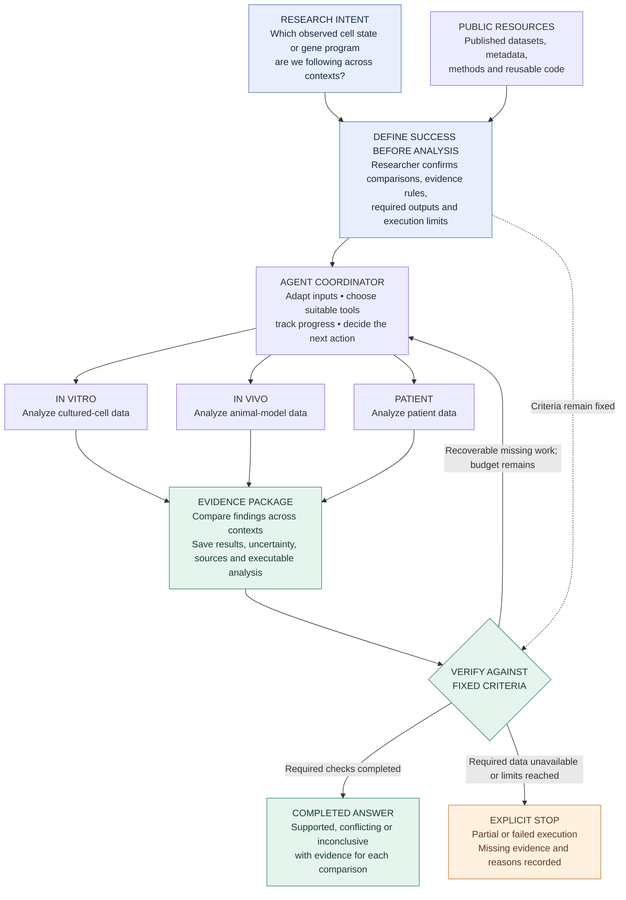

# Cross-context biology agent

Shared design and reusable-component review · 22 September 2026

**Audience:** project teammates and the agents assisting them.  
**Status:** the workflow structure is accepted; component selection and implementation remain open. Candidate repositories and documentation were inspected, but no packages were installed or benchmarked for this review.

## 1. Intent and scope

Help a computational biology researcher determine whether a cell state or gene program observed **in vitro** also appears **in vivo** and in **patient data**, and identify where the evidence changes or runs out.

The useful output is a comparison supported by actual analyses: which observations persist, which differ, which contexts cannot be compared, and what evidence would resolve the remaining uncertainty.

The first demonstration should use public, processed expression data and a narrowly defined observed program. Disease, accessions and numerical scientific thresholds have not been selected. Drug-response prediction, causal mechanism claims and clinical efficacy prediction are outside this design. Model selection and Modal engineering are reserved for the engineering phase.

## 2. Architecture



The three branches are analysis jobs; they do not require three separate conversational agents. Analyze each dataset in its appropriate context before comparing findings. The arrows do not establish a causal chain from cells to patients.

## 3. What counts as success?

### A. Completing a research task

Before execution, record the question, comparison groups, biological replicate unit, allowed analyses, evidence requirements, decision rules and budget. The agent may propose these; the researcher confirms the scientific choices.

| Requirement | Evidence and completion check |
|---|---|
| Suitable data | Accessions, versions, files, species, tissue/cell context, condition and independent sample IDs are recorded. Missing metadata is explicit. |
| Valid comparisons | Each comparison has a documented rationale. Record measured-cell species separately from animal host for xenografts; record ortholog mapping where needed. |
| Executed analysis | Required numerical outputs and execution records exist and pass their checks. Relevant parameters, input versions and software versions are preserved. |
| Supported interpretation | Every substantive conclusion links to an output and its uncertainty. Interpretive ambiguity is flagged for scientific review. |
| Bounded execution | Retries, time and cost obey the predeclared limits. Technical failure cannot be reported as a biological negative result. |

**Complete** means all required analyses and operational checks were finished. An inconclusive scientific answer can still be complete. Missing required data or unfinished analyses produce a partial result; unrecovered technical errors produce a failed result.

### B. Answering the scientific question

Report a separate finding for each comparison: **supported**, **conflicting**, **inconclusive**, or **not assessable**. A non-significant result alone does not establish absence or contradiction. Matching program scores alone does not establish a shared causal mechanism.

Choose effect-size, uncertainty and replication rules for the specific question before full analysis. Use patients, animals or independent culture experiments as the biological replicate units. Avoid treating individual cells as independent patients. Compare predefined within-dataset contrasts; do not assume absolute scores from different datasets are directly comparable.

Numerical and structural checks should inspect saved outputs with explicit rules. LLM review can assist interpretation but does not replace those checks. The agent may repair execution problems; changing the scientific question, thresholds or selected population creates a new versioned analysis.

### C. Demonstrating that the agent adds value

Use held-out cases with researcher-reviewed reference analyses, including supported findings, disagreement and insufficient evidence. Keep reference answers inaccessible to the running agent. Compare against a general agent given the same tools, data and budget. Measure valid task completion, unsupported claims, appropriate abstention, human corrections, time and cost. No superiority claim has been established yet.

## 4. Reusable candidates

The inventory below contains alternatives **within** layers and complementary components **between** layers. Availability means source/documentation inspected, not successful integration. License labels describe the identified code or skill; external datasets and services can have separate terms. Pin the chosen revision during engineering.

### 4.1 Agent tools and procedural skills

| Candidate | What can be reused | Fit and unresolved work |
|---|---|---|
| **[Biomni](https://github.com/snap-stanford/Biomni)** — Apache-2.0 core | Biomedical Python tools, tool descriptions, agent execution, custom-tool/MCP interfaces and Know-How documents. | First inspection target. Choose specific tools or evaluate the existing agent as a backend. Its broad environment and external dependencies need testing. The hosted Biomni Lab product is distinct from this public code. |
| **[ToolUniverse](https://github.com/mims-harvard/ToolUniverse)** — current [LICENSE](https://github.com/mims-harvard/ToolUniverse/blob/main/LICENSE): Apache-2.0 | Scientific tool discovery/execution through Python or MCP, plus a [dataset-discovery skill](https://github.com/mims-harvard/ToolUniverse/blob/main/skills/tooluniverse-dataset-discovery/SKILL.md). | Candidate for finding datasets and accessing APIs. A search result or successful API response does not prove that usable measurements or the needed metadata are available. |
| **[K-Dense Scientific Agent Skills](https://github.com/K-Dense-AI/scientific-agent-skills)** — repository MIT; individual licenses vary | Existing [Scanpy instructions/scripts](https://github.com/K-Dense-AI/scientific-agent-skills/blob/main/skills/scanpy/SKILL.md) and [Census access guidance](https://github.com/K-Dense-AI/scientific-agent-skills/blob/main/skills/cellxgene-census/SKILL.md). | Candidate for agent-facing procedures. Inspect only relevant skills. The inspected Scanpy skill declares BSD-3-Clause; skill instructions are separate from scientific validation. |
| **[Anthropic bio-research](https://github.com/anthropics/knowledge-work-plugins/tree/main/bio-research)** — skills Apache-2.0 | [Single-cell RNA QC](https://github.com/anthropics/knowledge-work-plugins/blob/main/bio-research/skills/single-cell-rna-qc/SKILL.md), associated QC scripts and other biological workflow guidance. | Candidate for input/QC procedures. Adapt QC to the dataset; passing QC does not establish comparability across contexts. External MCP services have separate requirements. |

### 4.2 Data access and numerical analysis

| Candidate | Role and code license | Fit and unresolved work |
|---|---|---|
| **[AnnData](https://github.com/scverse/anndata) + [Scanpy](https://github.com/scverse/scanpy)** | Annotated expression data, preprocessing and analysis; BSD-3-Clause. | Common data representation and baseline analysis. [Gene scoring](https://scanpy.readthedocs.io/en/stable/generated/scanpy.tl.score_genes.html) is available; metadata adapters and sample-level comparisons still need definition. |
| **[CELLxGENE Census](https://github.com/chanzuckerberg/cellxgene-census)** | Query metadata and actual expression slices; code MIT, Census data described as CC-BY. | Strong candidate for public reference data. Pin the release, avoid duplicate cells and verify dataset coverage and required conditions. See the [query guide](https://chanzuckerberg.github.io/cellxgene-census/cellxgene_census_docsite_quick_start.html). |
| **[GEOparse](https://github.com/guma44/GEOparse)** | Retrieve/parse accession metadata and deposited supplementary files; [BSD-3-Clause](https://github.com/guma44/GEOparse/blob/master/LICENSE). | Complementary route for cell-line, animal and patient experiments. A GEO record does not guarantee a ready-to-analyze count matrix; inspect each deposited file. |
| **[gget](https://github.com/scverse/gget)** | Gene lookup and modular access to several biological services; [BSD-2-Clause](https://github.com/scverse/gget/blob/main/LICENSE). | Useful for ID checks and selected queries. Its Census interface is an alternative access path, not an independent biological cohort. |
| **[decoupler](https://github.com/scverse/decoupler)** | Program/enrichment methods and [sample-level pseudobulk aggregation](https://decoupler.readthedocs.io/en/latest/api/generated/decoupler.pp.pseudobulk.html); [BSD-3-Clause](https://github.com/scverse/decoupler/blob/main/LICENSE). | Compare one chosen method, such as [ULM](https://decoupler.readthedocs.io/en/latest/api/generated/decoupler.mt.ulm.html), with the other scoring candidates. External prior networks have [separate licenses](https://decoupler.readthedocs.io/en/latest/notebooks/omnipath/licenses.html). |
| **[pyUCell](https://github.com/carmonalab/pyucell)** | Rank-based signature scoring for AnnData; [MIT](https://github.com/carmonalab/pyucell/blob/master/LICENSE). | Alternative to Scanpy scoring. Fix gene universe, rank parameters and missing-gene treatment. The Python package is distinct from the GPL-licensed R UCell implementation. See [parameters](https://pyucell.readthedocs.io/en/latest/notebooks/parameters.html). |

Scanpy scoring, pyUCell and decoupler methods estimate different quantities. Judge suitability against the scientific question and expected behavior, rather than requiring their raw scores to agree. Pseudobulk aggregation can complement a chosen scoring method.

### 4.3 Evaluation, packaging and execution control

| Candidate | What can be reused | Fit and unresolved work |
|---|---|---|
| **[AutoSciRub](https://github.com/zjunlp/AutoSciRub)** — MIT; [August 2026 paper](https://arxiv.org/abs/2608.31076) | Criteria schemas, literature-grounded rubric construction, evidence verification and bounded revision procedures. | Direct fit for defining expected evidence before execution. The host agent performs the research; biological decision rules and numerical checks remain our responsibility. |
| **[SkillFoundry](https://github.com/ma-compbio-lab/SkillFoundry)** — [Apache-2.0](https://github.com/ma-compbio-lab/SkillFoundry/blob/main/LICENSE); [April 2026 paper](https://arxiv.org/abs/2604.03964) | Framework and skill library for converting scientific resources into packages with scope, inputs/outputs, dependencies, provenance and tests. | Strong packaging candidate. First inspect existing relevant skills and a single bounded conversion. Operating its entire self-expanding library is unnecessary for the initial demo. |
| **[Google DeepMind Science Skills](https://github.com/google-deepmind/science-skills)** — software Apache-2.0; other materials CC-BY-4.0 | Scientific instructions/helpers and a [workflow-skill creator](https://github.com/google-deepmind/science-skills/blob/main/skills/workflow_skill_creator/SKILL.md). | Candidate for packaging a workflow after it has run successfully. The creator explicitly targets completed workflows. Source-specific terms are listed in [SKILL_LICENSES.md](https://github.com/google-deepmind/science-skills/blob/main/SKILL_LICENSES.md). |
| **[LangGraph](https://github.com/langchain-ai/langgraph) / [DeepAgents](https://github.com/langchain-ai/deepagents)** — MIT OSS | State, conditional execution and checkpoints; DeepAgents adds higher-level agent facilities and skill loading. | Engineering options for the coordinator, not biological analysis tools. Compare a small runner with LangGraph before adding a larger harness; durable recovery requires persistent state. |

## 5. Biomni-first inspection plan

Treat Biomni's executable tools, tool-description schemas and Know-How documents as distinct reuse surfaces. Do not assume that everything described as a platform “skill” is an exportable SKILL.md package.

Start with the following source-level candidates:

| Surface | Candidate use | Acceptance question |
|---|---|---|
| `query_geo` in [database.py](https://github.com/snap-stanford/Biomni/blob/main/biomni/tool/database.py) | Retrieve GEO search results for a structured query. It does not itself download the expression matrix. | Does it return the correct accessions and enough evidence to inspect file availability and sample metadata? |
| Synapse query/download helpers in [database.py](https://github.com/snap-stanford/Biomni/blob/main/biomni/tool/database.py) and [support_tools.py](https://github.com/snap-stanford/Biomni/blob/main/biomni/tool/support_tools.py) | Retrieve relevant deposited data if the selected study uses Synapse. | Are access requirements, download behavior and dependencies compatible with the demo? |
| `gene_set_enrichment_analysis` in [genomics.py](https://github.com/snap-stanford/Biomni/blob/main/biomni/tool/genomics.py) | Candidate enrichment helper. | This wraps unranked Enrichr-style enrichment; is that the intended analysis? It cannot stand in for a signed or cell-level program comparison. |
| `interspecies_gene_conversion` in [genomics.py](https://github.com/snap-stanford/Biomni/blob/main/biomni/tool/genomics.py) | Candidate BioMart-based gene mapping helper. | The inspected implementation does not explicitly filter one-to-one orthologs despite its description. Preserve orthology type, one-to-many mappings and unmapped genes in a reviewed adapter. |
| `A1.add_tool`, `A1.add_mcp`, `A1.create_mcp_server` in [a1.py](https://github.com/snap-stanford/Biomni/blob/main/biomni/agent/a1.py), with [MCP documentation](https://github.com/snap-stanford/Biomni/blob/main/docs/mcp_integration.md) | Register our adapters and checks around selected tools. | Can every invocation return explicit input references, output references and failure status? Review generated tool schemas before adopting them. |

Prefer importing or wrapping a small verified component when practical. If modifying copied code, preserve its upstream source, revision, license and attribution. Evaluate the full Biomni agent separately as an execution-backend candidate; do not bundle every framework into the first prototype.

## 6. Packaging for shared use

Use one shared design, portable skill instructions and explicit tool contracts. The following is a **proposed package layout**, not an implemented package:

```text
project/
  DESIGN.md                 # This shared document and decisions
  skills/
    cross-context-analysis/
      SKILL.md              # When to run; steps; stop and review rules
      references/           # Methods, upstream sources and examples
  tools/                    # Selected data/analysis/checking adapters
  schemas/                  # Dataset, criterion, evidence and run records
  evals/                    # Development fixtures and separate held-out cases
  runs/<run-id>/             # Versioned inputs, outputs, checks and report
```

| Shared record | Required information |
|---|---|
| Dataset manifest | Accession/release, source URL, actual file, processing state, species/host, context, sample IDs, metadata gaps and reuse terms. |
| Criterion record | Goal, required comparison, method/metric, fixed decision rule, expected evidence, checker and verification status. |
| Run manifest | Input references, tool/package versions, parameters, dependencies, budget, execution status and output locations. |
| Evidence record | Claim, context, dataset/sample IDs, numerical result, uncertainty, criterion ID and supporting output paths. |
| Verification report | Passed, failed and unresolved checks; reasons; remaining work; final execution status. |

Keep large expression matrices in data files; pass references and summaries to the agent. A completed step can be reused only when its inputs, parameters and relevant tool versions match. If a dataset changes, invalidate that branch and dependent comparisons. Preserve previous runs.

A skill explains **how to perform a task**; a tool performs a specific operation; a coordinator controls ordering and retries; an evaluator checks the evidence. An instruction that says “check your work” is not itself an implemented validator.

## 7. Candidate evaluation plan

First shortlist within each layer. These are proposed comparisons, not measured rankings.

| Comparison | Small trial | What decides usefulness |
|---|---|---|
| Biomni retrieval vs ToolUniverse vs direct access | Recover known accessions, metadata and file links from the same research question. | Correct identifiers, actual data accessibility, faithful missingness, source traceability and setup effort. |
| Anthropic vs K-Dense procedures | Same small expression dataset, same agent and same callable analysis code; vary only the procedural instructions. | Valid outputs, appropriate QC/replicate handling, omissions and human corrections. Test bundled-code differences separately. |
| Census direct API vs gget route | Same release, dataset and query slice. | Matching cell/gene IDs and metadata, explicit failures, transfer size and usability. |
| Scanpy vs pyUCell vs one decoupler method | Same predefined programs, biological samples and negative-control program. | Reference calculation correctness, missing-gene behavior, expected sensitivity, replicate-level behavior, runtime and memory. |
| AutoSciRub guidance vs a fixed hand-authored checklist | Same task, tools, budget and independent output checks. | Required analyses completed; unsupported claims caught; no loosening of scientific criteria. |
| SkillFoundry vs packaging a completed workflow with the DeepMind creator | One working analysis and a second input with changed metadata. | Explicit assumptions, reusable inputs/outputs, dependency recording and successful reuse with checked results. |
| Simple runner vs LangGraph | Interrupt a job and inject a recoverable tool error. | Correct resumption, bounded retries, accurate terminal states and no unnecessary repeat of completed work. |

Use separate development and held-out cases, split by study/biological samples. Include a recoverable failure, missing metadata, conflicting evidence and an inconclusive result. Define expected outputs with a researcher before comparing candidates. Repeat shortlisted agent configurations when feasible to expose run-to-run variability.

Use identical inputs, model, accessible tools, output requirements and budgets when attributing an improvement to instructions or orchestration. If tools or data access differ, label the result as a whole-package comparison. A small selection pilot does not establish general superiority.

## 8. Decisions before engineering

1. Choose one biological question and verify processed data plus sample metadata for the required contexts.
2. Fix the observed program, comparisons, replicate units and scientific decision rules.
3. Inspect the Biomni surfaces above and select the smallest candidate set for the first trials.
4. Choose data access, procedural guidance, numerical analysis and execution control separately from the trial evidence.
5. Implement one complete path through analysis, evidence checking and explicit termination; then package the working path for reuse.

The shared design is accepted. No specific disease, dataset bundle, agent backend or scoring method is selected by this document. Model/provider and Modal deployment choices remain deferred as requested.
