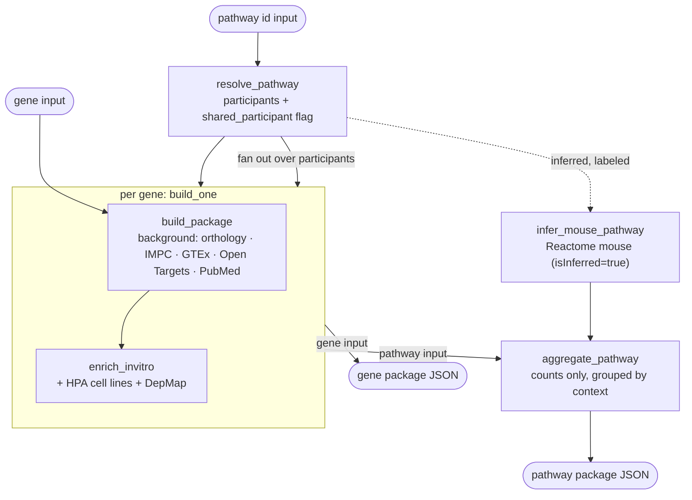

# Evidence Pipeline — Data Flow (Person A)

Turns a **gene** or a **pathway** into one deterministic, **context-tagged evidence
package** — the factual substrate Person B's coordinator reasons over. It makes **no
judgments and no scores** (v3 §9): every field is a retrieved fact or an explicit gap.

## Two ways in

| Input | Command | Output |
|-------|---------|--------|
| **Gene** | `modal run app.py::main --genes MLH1,MSH2 --disease "colorectal cancer"` | per-gene evidence package |
| **Pathway** | `modal run app.py::pathway --reactome-id R-HSA-5358508` | pathway details only — members, description, defining PMIDs, hierarchy, GO, mouse inference (fast, no gene fan-out) |
| **Pathway (+members)** | `… --members-evidence` | + per-member gene evidence rollup by species/context (heavier) |

## Flow

## Evidence organized by context — mirrors the v3 §1/§2 boxes

Tracked as **context × species × modality × individual**. Unavailable contexts stay as
**visible gaps** (v3 §1), never dropped.

```mermaid
flowchart TB
    subgraph VITRO ["IN VITRO — cell lines / organoids"]
        direction TB
        V1["species: human · culture/cell-line IDs"]
        V2["RNA — HPA cell-line nTPM (summary)"]
        V3["protein — HPA subcellular / class"]
        V4["functional — DepMap CRISPR fitness (isEssential, geneEffect)"]
    end
    subgraph VIVO ["IN VIVO — animal models"]
        direction TB
        M1["species: mouse/rat/macaque · orthology type kept"]
        M2["phenotype — IMPC (phenotyped? MP terms)"]
        M3["pathway — Reactome mouse inference (LABELED inferred)"]
        M4["DNA/RNA/protein — gap"]
    end
    subgraph PAT ["PATIENTS — disease cohorts (cohort-level)"]
        direction TB
        P1["cohort background — HPA pathology (TCGA): disease involvement, cancer RNA"]
        P2["individual variation (patient/specimen IDs) — GAP"]
        P3["per-patient / matched needs GEO / CELLxGENE / GDC (out of scope)"]
    end
    HR["human reference (background): GTEx baseline · Open Targets association* · PubMed"]
    VITRO --> PKG([context-tagged package])
    VIVO --> PKG
    PAT --> PKG
    HR --> PKG
    classDef gap fill:#fff0df,stroke:#ba8140,color:#573b1d;
    class PAT gap;
```

\* Open Targets **association** = disease link; skipped in `eval` mode (leaks answers).
Baseline expression, HPA, and DepMap fitness are **not** association → kept in `eval`.

## Contract, independence, aggregation

- **Four statuses**, never conflated: `ok` / `not_found` (a database fact, not a
  biological negative) / `error` (never cached, retried) / `skipped`.
- **Independence** (v3 §3): sources declare `source_dependencies`; a direct IMPC query
  and Open Targets' IMPC-derived evidence share the `IMPC` provider and count **once**.
- **No scores** (v3 §9): pathway rollup is counts only — per-species ortholog coverage,
  IMPC phenotyped ratio, DepMap essential count, and **shared vs exclusive participants**
  (PCNA/RPA/POLD also in DNA replication → `shared_participant`; MLH1/MSH2 exclusive).

## Source contracts

[`tools.md`](tools.md) is auto-generated from `registry.py` (v3 §4.5) — one entry per
source with purpose, inputs, output meaning, limitations, failure behavior, version, and
its §6 evidence dimensions (role, origin, measured/inferred, species, context, modality,
dependencies).

## Verified (2026-09-22)
Live on Modal — **gene input** (`MLH1`): in-vitro/in-vivo/human-reference evidence built.
**Pathway input** (`R-HSA-5358508`): 15 participants built in one pass; in-vitro (HPA +
DepMap, 7 essential), in-vivo (14 mouse one2one, IMPC 5/5 phenotyped, mouse inference
labeled), human reference (GTEx), patients = HPA cohort-level (individual variation still
gap); 9 shared / 6 exclusive. `pytest`: 22 passed.
