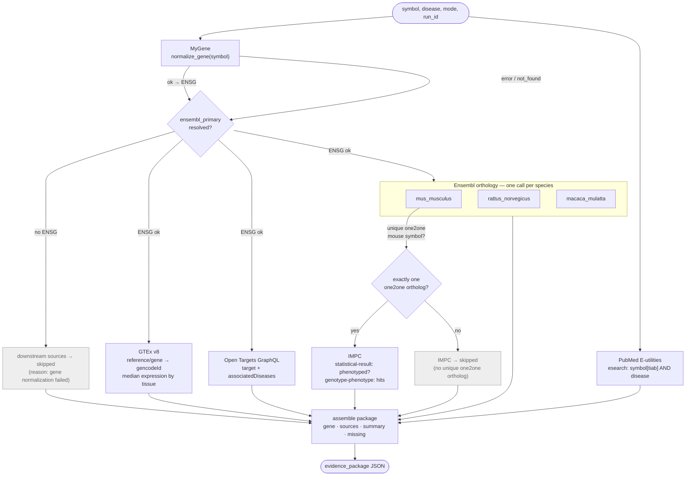
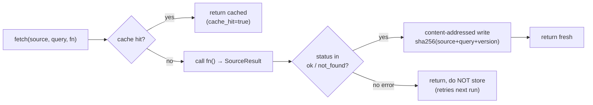
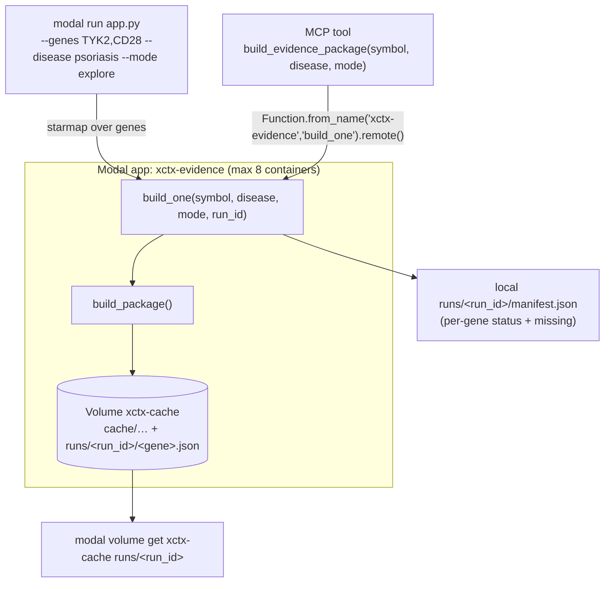

# Evidence Pipeline — Data Flow

Person A's pipeline turns **one human gene symbol** into **one evidence-package JSON**
by querying five target-knowledge sources, caching every result, and fanning the work
out across Modal containers. The LLM coordinator never touches the network — it only
reads the deterministic package these tools produce.

## Status contract

Every source fetcher returns a `SourceResult` and **never raises**. Exactly four statuses:

| Status | Meaning | Cached? |
|--------|---------|---------|
| `ok` | record found | ✅ |
| `not_found` | query succeeded, source has no record (a database fact, not a biological negative) | ✅ |
| `error` | technical failure (network, schema drift, rate limit) | ❌ never |
| `skipped` | disabled by mode, or an upstream step failed | n/a |

## Per-gene source flow (`package.build_package`)

**Mode gating** — `--mode eval` disables `pubmed` and `opentargets` (both become `skipped`)
so benchmark answers cannot leak; cross-species sources (orthology, GTEx, IMPC) stay on.

## Cache layer (`cache.JsonCache`)

Content-addressed by `sha256({source, query, CACHE_VERSION})`; writes are atomic
(`tmp` + `os.replace`). Bump `CACHE_VERSION` when a fetcher's output shape changes.

## Fan-out & serving (`app.py`, `mcp_server.py`)

Containers `vol.reload()` before reading and `vol.commit()` after writing, so cache
entries are shared across the fan-out. Optional `ncbi-api-key` secret raises the PubMed
rate limit when `USE_NCBI_SECRET=1`.

## Verified end-to-end (2026-09-22)

| Gene | explore | eval | Notes |
|------|---------|------|-------|
| TYK2 | all 5 sources `ok`, `missing=[]` | pubmed/opentargets `skipped` | GTEx, IMPC (24 hits), Open Targets all live |
| CD28 | rat ortholog `not_found` (legit), rest `ok` | + pubmed/opentargets `skipped` | mouse one2one → IMPC (4 hits) |

Both genes ran through Modal; packages landed on the `xctx-cache` volume under
`runs/20260922T154435-explore/` and `runs/20260922T154534-eval/`.
