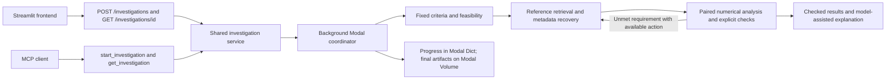

# Shared investigation coordinator

This implements the approved service architecture around the canonical
[scientific design](../cross-context-biology-agent.md). The data pipeline is one
retrieval adapter; it is not the whole investigation.

## API contract

- `POST /investigations`: a version `1.0` `InvestigationRequest`; returns HTTP 202
  with `id`, `status`, `created_at`, and the SHA-256 `contract_hash`.
- `GET /investigations/{id}`: progress, events, frozen request, usage, reference
  packages, errors, and final report. Unknown/expired IDs return 404.
- `/mcp/`: Streamable HTTP MCP; exposes `start_investigation(request)` and
  `get_investigation(investigation_id)` over the **same service**.
- `/health`: deployment health only, not a check of credentials or upstream sources.
- `/docs` and `/openapi.json`: schema documentation (same access token as API).

Statuses are `queued`, `running`, `needs_input`, `complete`, `partial`, and `failed`.
Scientific findings are independently `supported`, `conflicting`, `inconclusive`,
or `not_assessable`. An inconclusive comparison can have complete execution.
Poll at intervals of at least three seconds. A changed question, input, or criterion
is a new investigation; the initial request and its hash never change.

## Implemented workflow

1. Record the request and confirm scientific criteria. No supplied/confirmed criteria
   means `needs_input`; thresholds are never invented. Resubmit a confirmed contract.
2. Inspect required contexts, modalities, study IDs, species, tissue, sample identity,
   assay quantities, and supplied mappings.
3. Select feasible retrieval or metadata-recovery actions. Claude can select among
   eligible actions, with a deterministic fallback if selection fails. It cannot
   add tools, change criteria, or execute arbitrary code.
4. Invoke the existing `xctx-evidence/build_one`, read the JSON from `xctx-cache`,
   and preserve source statuses. These records are background evidence. They do not
   replace assay measurements or establish biological support.
5. Read declared sample maps to fill missing subject/specimen/time metadata. Existing
   identities cannot be overwritten. Re-run checks after recovery, within the same
   fixed criteria and budget. There is no arbitrary URL/file access or search for
   undeclared sample maps.
6. Calculate supported paired comparisons, preserve individual results, and keep
   unavailable contexts visible. Compare findings without pooling raw assay units.
7. Generate an optional model-assisted explanation from the checked results and
   reference excerpts. Reject changed criterion statuses and invented evidence IDs.
   Free-text interpretation still requires scientific review; citation checks do
   not prove every sentence is entailed by its source.
8. Record terminal status, trace, input hash and usage. Cloud final reports also go
   to `xctx-investigation-artifacts/<id>.json`.

## First numerical adapter and its boundaries

`paired_log2_ratio_t_interval` operates on **positive processed measurements**. For
each biological subject it computes `log2(treatment) - log2(control)`, then the mean
and a Student t confidence interval across subjects. Each criterion explicitly
specifies the expected direction, minimum effect, minimum pairs and confidence
level. Support requires the entire interval beyond the declared effect threshold
in the expected direction; conflict requires it beyond the opposite threshold.
Other successfully calculated results are inconclusive.

These are paired designs, not independent case/control cohorts. Units and assay
must match within each modality. Subject IDs—not cells—define replicate pairs.
Repeated subject/condition measurements require a separate aggregation adapter.
Matched modalities must share subject, specimen and time identifiers. Unpaired
modality cohorts can only be considered when `matched_modalities=false` was fixed
in advance, and cannot establish within-person corroboration.

The method assumes independent biological subjects and approximately normal log2
ratios; the code does not establish those assumptions. It does not correct for
multiple testing, infer causal mechanisms, validate clinical efficacy, or provide
population-level conclusions from a small fixture.

Non-human comparisons require an explicit, reviewed one-to-one mapping to the
canonical feature. Mapping types and sources, measured species and animal hosts
remain in the report. This first adapter rejects ambiguous mappings rather than
inventing an ortholog. Supplied study IDs track independence; the implementation
does not automatically discover that differently labeled studies reused a cohort.

Raw expression processing, arbitrary statistical methods, protein activity inferred
from abundance, broad dataset discovery, full Biomni/ToolUniverse integration and
scientific selection of thresholds are not implemented. The service/record boundaries
allow additional analysis tools without a second frontend or MCP-specific workflow.

## Execution and model limits

Requests cap wall time, external tool calls, model calls, output tokens and total
model tokens. Token counting occurs before each generation. Input arrays are
bounded, large reference arrays are explicitly excerpted, and full packages remain
in the saved result. Timeouts retain completed evidence and return partial. Required
retrieval technical errors return failed; optional reference errors remain visible.
Required missing data returns partial. The model cannot upgrade checked findings.

Local `COORDINATOR_MODEL_ENABLED=0` is an explicit numerical-development mode; reports
say interpretation was disabled. It does not simulate Claude. Cloud workers require
the configured model secret and call the real Anthropic SDK. The default model can
be changed through `ANTHROPIC_MODEL` at deployment.

## Persistence and access

Local runs are JSON files under `runs/coordinator`, with atomic writes. Local tasks
are development workers: a server restart does not resume them; stale runs become
failed when polled. Modal uses spawned background jobs, a named Dict for live run
state, and a Volume for final artifacts. Dict entries and job outputs have platform
retention limits; download results or use the archived Volume. This is not a
general checkpoint/resume system; automatic worker retries are disabled to avoid
repeating expensive operations silently.

The cloud API and MCP require `Authorization: Bearer <INVESTIGATION_API_TOKEN>`.
The hosted frontend requires the same team access code and keeps the token server-side.
This is a shared-team demo credential, not per-user authorization or an OAuth service.
MCP clients must support custom authorization headers; a client requiring OAuth-only
connector setup needs an OAuth adapter. Claude web/Science connection has **not** been
verified. The repository includes a Python MCP client smoke test.

No claim of outperforming another agent is made. The development fixture and unit
tests are not held-out evaluation; follow section 7 of the scientific design for
a separate, researcher-reviewed evaluation.
